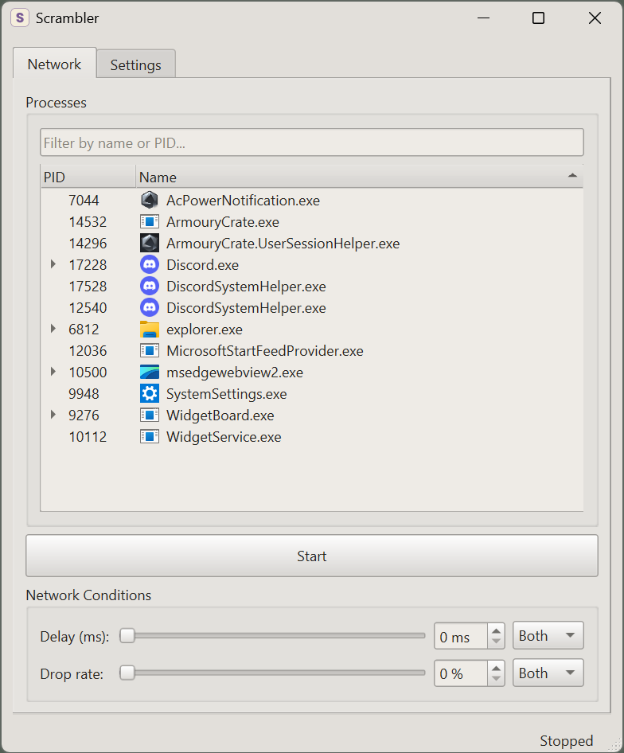
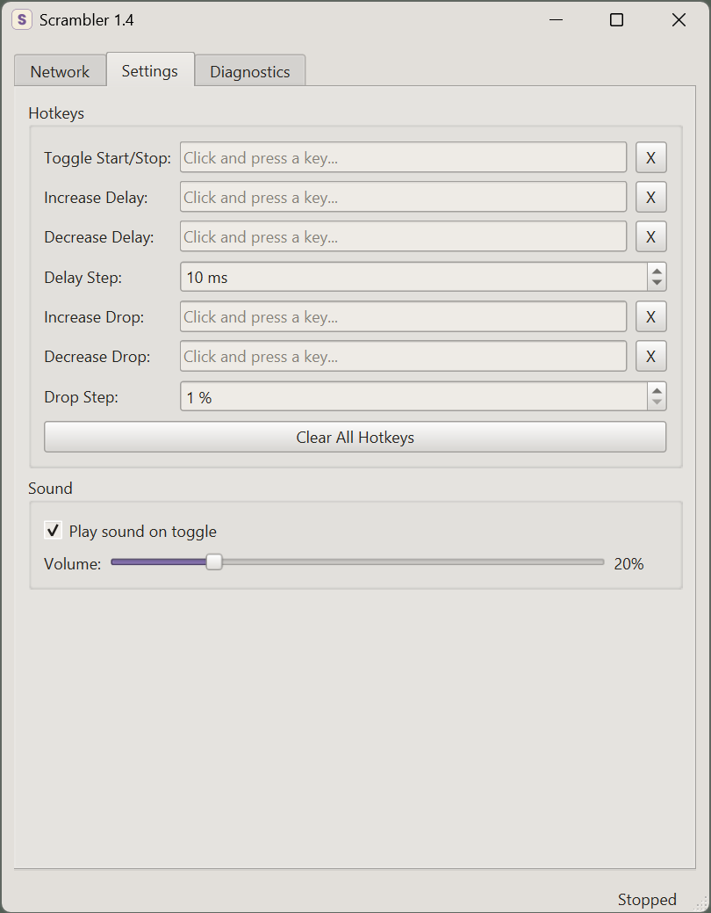
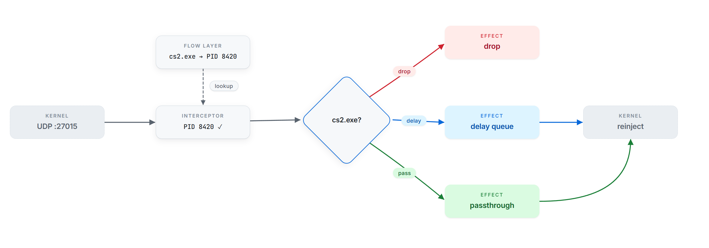

# Scrambler
Scrambler is a Windows utility designed to simulate poor network conditions for testing purposes. It leverages WinDivert to intercept UDP (IPv4) traffic at the kernel level, allowing it to selectively delay or drop packets for specific processes. This can help developers test their applications under certain network conditions.

| Main Window | Settings Window |
|-------------|----------------|
|  |  |

## Features

| Feature | Description |
|---------|-------------|
| **Per-process targeting** | Select any running process from a filterable tree and apply effects only to its UDP traffic          |
| **Packet delay** | Add configurable latency (0–1000 ms)                                                                          |
| **Packet drop** | Probabilistic packet loss (0–100%)                                                                             |
| **Independent direction filtering** | Configure inbound, outbound, or both directions separately for each effect                 |
| **Global hotkeys** | Adjust delay, drop rate, and toggle effects by using hotkeys with support for modifiers                     |
| **Sound feedback** | Audible tone on start/stop with configurable volume                                                         |
| **Persistent settings** | All settings are saved upon exit                                                                  |

## How It Works
Scrambler operates on two WinDivert layers at the same time:
1. The FLOW layer tracks connection events and maps network 5-tuples (source/destination IP and ports, plus protocol) to process IDs.
2. The NETWORK layer intercepts UDP packets, identifies the owning process using that mapping and applies delay or drop effects when needed.



For flows that existed before Scrambler started, it falls back to querying the Windows UDP table via GetExtendedUdpTable.
Non-targeted traffic is reinjected immediately with no modification.

## Requirements
- Windows 10 or later (64-bit)
- Must be run as Administrator since WinDivert requires kernel-level access to install its driver

## Installation
Download the latest release zip from the [Releases page](https://github.com/rosenqvist/Scrambler/releases), extract anywhere and launch `Scrambler.exe`. Windows will prompt for Administrator permission on start. No installer needed.
The WinDivert driver is automatically loaded on first use and unloaded on exit or reboot.

> [!WARNING]
> **USE AT YOUR OWN RISK**
> This tool installs a **kernel-level network driver (WinDivert)** that intercepts and modifies network packets.
> Many online games use anti-cheat systems that may **detect, block, or ban users** for running software that interacts with network traffic at the kernel level.
>
> **Do not run Scrambler alongside games that use kernel-level anti-cheat systems.**
> - Close Scrambler before launching such games
> - Reboot your system to ensure the **WinDivert driver is fully unloaded**
---
### Intended Use

This tool is designed for **legitimate testing purposes only**, including:

- Simulating poor network conditions
- Development and QA
- Debugging networked applications

## Quick Start
1. Launch `Scrambler.exe`.
2. Select a process from the list, or use the filter box to find it.
3. Set the network conditions you want to apply.
4. Click `Start` to begin intercepting traffic.
5. Open the `Diagnostics` tab if you want to check counters and logs while the app is running.
6. Use the main toggle button again when you want to stop.

## Limitations
- Windows only
- UDP over IPv4 only. TCP and IPv6 traffic are not affected.
- Must be run as Administrator
- Only traffic that can be matched to the selected process is affected. Everything else is passed through unchanged.

## Building from Source

### Prerequisites

Before building, ensure you have the following installed:

- **[CMake](https://cmake.org/download/)**
- **[Ninja](https://ninja-build.org/)**
- **[LLVM/Clang](https://llvm.org/builds/)** installed, with `clang-cl` available on `PATH`
- **[Visual Studio](https://visualstudio.microsoft.com/downloads/)** or **[Visual Studio Build Tools](https://visualstudio.microsoft.com/downloads/)** with the C++ tools and Windows SDK installed
- **[vcpkg](https://github.com/microsoft/vcpkg)**
- `VCPKG_ROOT` set to your vcpkg folder

Run the commands below from a shell where the Visual Studio C++ tools are available. Developer PowerShell for Visual Studio is the simplest option.

---
### Build

**Debug build:**

```powershell
cmake --preset debug
cmake --build --preset debug
```
**Release build:**

```powershell
cmake --preset release
cmake --build --preset release
```

The `relwithdebinfo` and `relwithdebinfo-asan` presets are built the same way. Replace the preset name in the commands above when needed.

### Available Presets

| Preset                | Description                                            |
|-----------------------|--------------------------------------------------------|
| debug                 | Debug build with tests enabled                         |
| release               | Optimized release build                                |
| relwithdebinfo        | Optimized build with debug symbols (Application Verifier)|
| relwithdebinfo-asan   | Optimized build with debug symbols and AddressSanitizer (unit tests only) |

## Testing

Scrambler uses three test setups on Windows:

- **`debug`** for unit tests while developing:

  ```powershell
  ctest --preset debug
  ```

- **`relwithdebinfo-asan`** for extra memory checks in the unit tests:

  ```powershell
  ctest --preset relwithdebinfo-asan
  ```

  This preset covers the core packet effect and process targeting logic, including an 8-thread concurrent stress test.
  ASan is not run against `scrambler.exe` itself because the prebuilt Qt 6 binaries from vcpkg don't support it.

- **`relwithdebinfo`** for Microsoft Application Verifier on the full application.
  Use the Basic check group (Exceptions, Handles, Heaps, Leak, Locks, Memory, ThreadPool, TLS).

## Third-Party Licenses

This project uses the following third-party software:

- **[WinDivert](https://github.com/basil00/Divert)** Dual-licensed under **LGPL v3** or **GPL v2**.
  WinDivert is dynamically linked and distributed unmodified.

- **[Qt 6](https://www.qt.io/)** Licensed under **LGPL v3**.
  Qt is dynamically linked and distributed unmodified.

- **[Google Test](https://github.com/google/googletest)** Licensed under **BSD 3-Clause**.
  Used for testing only, not distributed.

##  License

This project is licensed under the **[GNU General Public License v3.0](https://www.gnu.org/licenses/gpl-3.0.html)**.
See the `LICENSE` file for details.

This license is compatible with both WinDivert (LGPL v3 / GPL v2) and Qt (LGPL v3), and ensures that any modifications to Scrambler remain open source.
